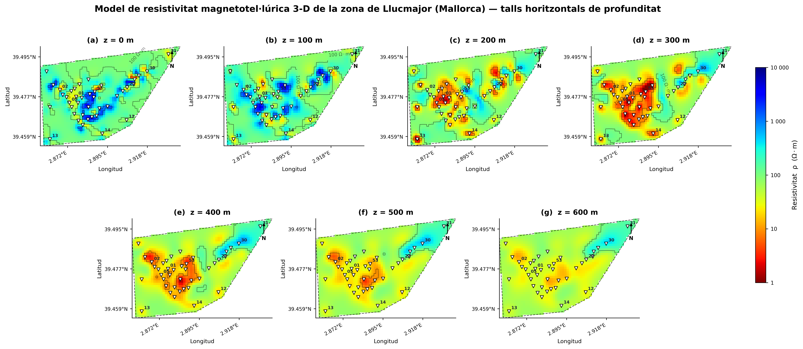
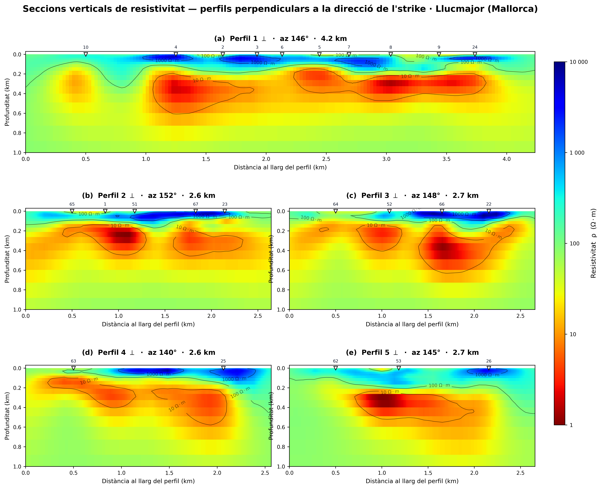
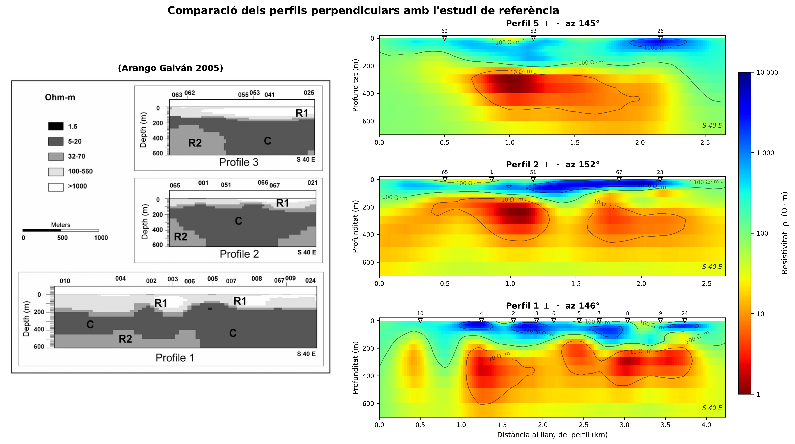

# 3D Magnetotelluric Inversion of the Llucmajor Geothermal Reservoir (Mallorca)

**Bachelor's thesis in Physics** · Universitat de les Illes Balears · 2025–2026
**Author:** Albert Rius Saborit · **Supervisor:** Dr. Anna Martí Castells (Universitat de Barcelona) · **Grade:** 8.5 / 10

> *Inversió geofísica de dades magnetotel·lúriques del reservori geotèrmic de Llucmajor*



## Abstract

This study uses the magnetotelluric (MT) method, a geophysical technique that images geoelectrical
structures by measuring the surface currents induced by natural electromagnetic fields. It applies a
formal **gradient-based 3D inversion (NLCG, ModEM)** to MT data from **40 stations** in the Llucmajor
aquifer system (Mallorca, Spain). Earlier studies of the area characterised the subsurface by solving
the forward problem through trial and error. The inverted model is clearly similar to that earlier
result, which shows the value of an objective and easily reproducible methodology.

## Highlights

- **Full processing pipeline in Python**: EDI exploration, dimensionality analysis (phase tensor),
  noise and powerline analysis, manual and automatic data cleaning (Hampel, LOWESS), and 1D inversion
  (Bostick, Occam, smooth Levenberg–Marquardt).
- **3D inversion with ModEM** on an HPC cluster: 68 × 68 × 30 mesh (138,720 cells) covering
  35 × 35 × 68 km, with 150 m core cells, bathymetry and a fixed sea mask. The data are the full
  impedance tensor at 39 periods (8 kHz to 0.12 Hz, 3,980 data points).
- **Systematic comparison of more than 20 inversion runs** (error floors, smoothing, data cleaning and
  period ranges), using RMS convergence, per-station and per-period misfit, and model-norm trade-offs.
- **Publication-quality figures**: depth slices, vertical cross-sections and a direct comparison with
  the reference 3D model (Arango, 2005).

| Vertical cross-sections | Comparison with reference model |
|---|---|
|  |  |

## Repository structure

```
├── src/
│   ├── 01_data_exploration/      EDI reading, dimensionality and phase-tensor analysis, noise analysis
│   ├── 02_data_cleaning/         Outlier removal, smoothing (LOWESS/Hampel), cleaned vs original data
│   ├── 03_inversion_1d/          1D Bostick / Occam / smooth Levenberg–Marquardt inversions
│   ├── 04_mesh_and_bathymetry/   Sea mask and bathymetry applied to the ModEM mesh
│   ├── 05_inversion_3d_modem/    Mesh construction, error floors, period merging, skin-depth contour
│   └── 06_visualization/         Depth slices, cross-sections, RMS analysis, run comparison, maps
├── results/
│   ├── final_model/              Final ModEM model (Run 635, NLCG iteration 92), log, setup and per-station fits
│   ├── figures/                  Main figures (PNG/PDF)
│   ├── tables/                   Run summaries and RMS tables (CSV/LaTeX)
│   └── inversion_1d/             1D inversion figures
├── thesis/                       Final thesis (PDF) and LaTeX source with all figures
├── presentation/                 Defense slides (PDF) and Beamer source with a custom theme
├── docs/notes/                   Study notes written during the project (MT theory, ModEM, RMS, units)
└── data/                         Information about the (non-included) field data
```

## Method overview

1. **Data exploration.** Read the EDI files, plot apparent resistivity and phase, and analyse
   dimensionality with phase-tensor skew to decide between 1D, 2D and 3D modelling.
2. **Data cleaning.** Handle powerline and cultural noise, manually clean the impedance components,
   and test automatic smoothing (Hampel, LOWESS). Automatic methods were not sufficient, so the final
   model uses manual cleaning.
3. **1D inversion.** Run Bostick and Occam-style inversions per station as a first look at the
   resistivity structure.
4. **3D mesh.** Build the ModEM grid and add the coastline, bathymetry and a fixed-resistivity sea
   (0.3 Ω·m).
5. **3D inversion.** Run NLCG inversions (ModEM) on the UB MAGMA cluster with different error floors,
   covariance smoothing and period ranges.
6. **Model selection and interpretation.** The final model, *Manual Cleaning 2*, keeps the diagonal
   impedance components. It was chosen for the balance between data fit and geological plausibility,
   not only for the lowest RMS. It is then compared with the reference model.

## Final model

| Parameter | Value |
|---|---|
| Algorithm | NLCG (ModEM) |
| Mesh | 68 × 68 × 30 cells, 35 × 35 km, 68 km deep |
| Data | Full impedance tensor (Zxx, Zxy, Zyx, Zyy), 40 stations, 39 periods |
| Error floor | 5 % of √\|Zxy·Zyx\| (off-diagonal); diagonals cleaned manually and weighted |
| Regularisation | Recursive autoregression, smoothing 0.2 / 0.2 / 0.2 |
| Final normalised RMS | 3.81 |

Full parameters: [`results/final_model/modem_setup/taula_parametres.txt`](results/final_model/modem_setup/taula_parametres.txt)

## Getting started

```bash
python -m venv .venv
.venv\Scripts\activate          # Windows  (Linux/macOS: source .venv/bin/activate)
pip install -r requirements.txt
```

> **Note:** the scripts were written for the original project folder and several contain absolute
> Windows paths (e.g. `C:\Users\alber\TFG\...`). Update the paths at the top of each script before
> running it. The field data are not included (see [`data/README.md`](data/README.md)), so the
> data-processing scripts need your own EDI files. The visualization scripts can read the final model
> in `results/final_model/`.

## Data availability

The MT data come from a 2002 field campaign (42 stations) led by the University of Barcelona and are
**not included** in this repository. See [`data/README.md`](data/README.md).

## Tools

Python (NumPy, SciPy, Matplotlib, pandas, MTpy v2, PyVista, Shapely, pyproj, statsmodels) ·
ModEM (Fortran, run on an HPC cluster) · LaTeX / Beamer

## Key references

- Arango Galván, C. (2005). *Estudi magnetotel·lúric de la zona de Llucmajor (Mallorca): Avances en el
  proceso de datos y modelo 3D*. PhD thesis, Universitat de Barcelona.
- Kelbert, A., Meqbel, N., Egbert, G. D., & Tandon, K. (2014). ModEM: A modular system for inversion
  of electromagnetic geophysical data. *Computers & Geosciences*, 66, 40–53.

The full bibliography is in the [thesis](thesis/TFG_Albert_Rius_Saborit.pdf).

## License

- **Code** (`src/`): [MIT License](LICENSE)
- **Thesis, slides, figures and notes**: [CC BY-NC-ND 4.0](https://creativecommons.org/licenses/by-nc-nd/4.0/),
  the same license as the version in the UIB repository
- Fonts in `presentation/latex/fonts/`: SIL Open Font License 1.1 (see `LICENCIAS.txt`)
